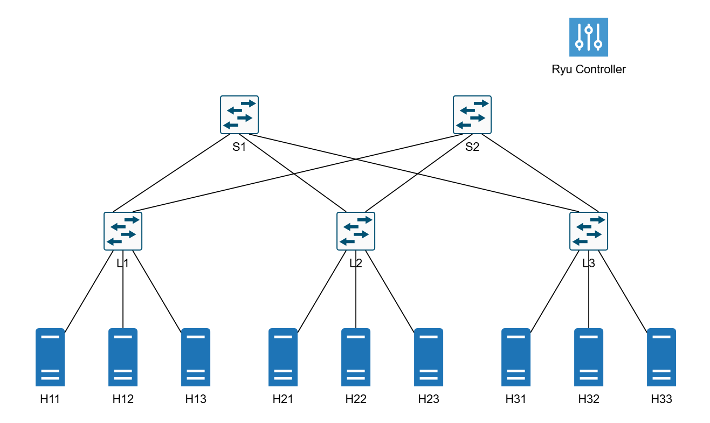

# Hệ thống giám sát mạng SDN

Đồ án giám sát mạng SDN cùng với các tính năng như tạo traffic ngẫu nhiên, giám sát thời gian thực và các chức năng hiển thị thông tin giám sát. Được chạy với Mininet topology trên OpenVSwitch, Ryu SDN controller, trình thu thập metrics Prometheus và dashboard trên Grafana.

## Các tính năng

- **🏗️ Complete SDN Lab Environment**: Môi trường thực hành mạng SDN đầy đủ: Mininet topology đã được cấu hình với kiến trúc mạng Spine-leaf
- **🎛️ Ryu SDN Controller**: Controller tùy chỉnh với các khả năng định tuyến và giám sát nâng cao
- **📊 Giám sát thời gian thực**: Prometheus metrics được thu thập trực tiếp từ controller
- **📈 Dữ liệu trực quan**: Grafana dashboards để giám sát và phân tích hiệu suất mạng
- **🚀 Tạo lưu lượng tự động**: Các lưu lượng ngẫu nhiên với nhiều giao thức (TCP, UDP, ICMP)
- **🔄 Trình quản lý Flow**: Giao diện web để quản lý flow rule
- **🐳 Container hóa**: Môi trường thực hành trên các container để dễ dàng triển khai

### Network Topology

Triển khai kiến trúc Spine-leaf mô phỏng các data center với
- **2 Spine Switches**: Core layer cho kết nối inter-rack
- **4 Leaf Switches**: Edge layer để kết nối đến các host
- **6 Hosts**: Mô phỏng các thiết bị (h1 - h6)



## 📋 Yêu cầu hệ thống

- **Docker**: Phiên bản 20.10 hoặc mới hơn
- **Docker Compose**: Phiên bản 2.0 hoặc mới hơn
- **Git**: Để clone repo này
- **Cấu hình hệ thống tối thiểu**:
  - CPU: 2 cores
  - RAM: 4GB
  - Disk: 2GB ổ đĩa trống

## 📖 Thực hiện

### Bước 1: Thiết lập môi trường

```bash
# Clone repo
git clone https://github.com/kusanali3110/sdn_project
cd sdn_project

# Khởi động các container service
docker-compose up -d

# Kiểm tra rằng các container đang chạy
docker ps -a
```

### Bước 2: Thiết lập network topo

```bash
# Truy cập vào container Mininet
docker exec -it mininet bash

# Tạo network topo kết nối đến Ryu controller
mn --custom /app/spine_leaf.py --topo spineleaf --controller remote,ip=ryu,port=6653 --switch ovsk,protocols=OpenFlow13
```

### Bước 3: Tạo traffic ngẫu nhiên

Khi đã ở bên trong Mininet CLI sau khi thiết lập network topo tại bước 2 (đầu vào `mininet>`):

```bash
# Khởi động tạo traffic
mininet> py exec(open('/app/traffic_generator.py').read())
```

Traffic generator sẽ:
- Tạo ngẫu nhiên lưu tượng TCP/UDP/Ping
- Chọn cặp host nguồn/đích ngẫu nhiên
- Sử dụng bandwidth và timing ngẫu nhiên
- Chạy liên tục cho đến khi dừng lại thủ công (Ctrl + C)

## 🌐 Các Endpoint

Sau khi thực hiện các hướng dẫn ở trên, các endpoint sau đây sẽ có thể được truy cập:

| Service | URL | Description | Credentials |
|---------|-----|-------------|-------------|
| **Grafana** | http://localhost:3000 | Visualization & Dashboards | admin/admin |
| **Flow Manager** | http://localhost:8080/home/index.html | SDN Flow Management | - |
| **Prometheus** | http://localhost:9091 | Metrics Collection | - |
| **Metrics** | http://localhost:9090/metrics | Raw Metrics Endpoint | - |

## 📊 Monitoring & Visualization

### Flow Management

Truy cập giao diện web Flow Manager tại http://localhost:8080/home/index.html để:
- Xem các flow rule hiện tại
- Thêm/chỉnh sửa các flow entry
- Giám sát thông số switch
- Quản lý SDN policies

### Grafana Dashboards

Hệ thống được truy cập tại http://localhost:3000 bao gồm 3 dashboard đã được cấu hình trước:

1. **Network Monitoring**: Network topo và trạng thái mạng thời gian thực
2. **Performance Analysis**: Chi tiết về hiệu suất mạng
3. **Traffic Analysis**: Traffic patterns và phân tích về giao thức

### Các key metrics được giám sát

- **Thông số switch**: Số port và mức sử dụng của flow table
- **Traffic metrics**: Băng thông sử dụng, tỷ lệ gói tin và phân phối protocol
- **Hiệu suất mạng**: Độ trễ, jitter, packet loss
- **Flow Rules**: Các flow đang hoạt động, rule hit counts, thời gian tồn tại

### Prometheus Metrics

- Raw metrics có thể được xem tại http://localhost:9090/metrics
- Truy cập Prometheus UI tại http://localhost:9091 để có thể truy vấn metrics hoặc thiết lập các exporter...
---
